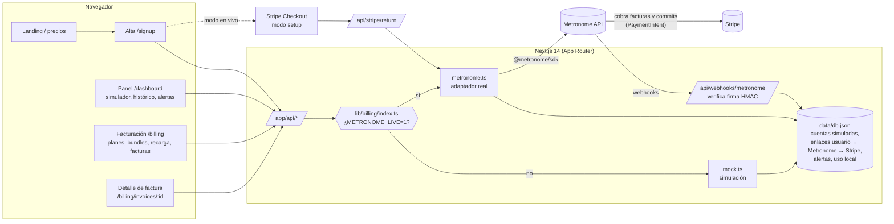

# nebula.ai · Demo de facturación por uso con Metronome + Stripe

Demo en español de una SaaS ficticia, **nebula.ai**, que vende una API de IA generativa (texto e imágenes) con planes por uso. La facturación se modela en **Metronome** y los cobros se hacen con **Stripe**. **Todas las cifras son de ejemplo.**

- **Modo simulado** (por defecto): no llama a nada externo. Reproduce en local el comportamiento acordado de Metronome + Stripe y guarda los datos en `./data/db.json`, así que sobreviven a los reinicios.
- **Modo en vivo** (Metronome en vivo): llama a la API real de Metronome con el SDK oficial [`@metronome/sdk`](https://www.npmjs.com/package/@metronome/sdk) y usa Stripe Checkout en modo *setup* para guardar la tarjeta.

En todas las pantallas se ve un indicador **«Modo simulado»** (ámbar) o **«Metronome en vivo»** (verde).

## Catálogo (datos de ejemplo)

| | Free | Pro | Scale |
|---|---|---|---|
| Cuota mensual | 0 € | 29 € | 199 € |
| Créditos incluidos/mes | 5 € | 30 € | 250 € |
| Descuento en uso | – | 10 % | 20 % |
| Al llegar a 0 € | se corta el acceso | se corta el acceso (o recarga automática) | el exceso se factura a fin de mes |

Uso: tokens de entrada 2 €/M, tokens de salida 8 €/M, imágenes 0,04 €. Bundles: pagas 50 → recibes 55; 200 → 230; 1000 → 1200. Recarga automática (Pro/Scale): si el saldo baja de 10 €, se recarga ~50 €. Alerta de saldo bajo al 20 % y a 0.

## Arquitectura



Piezas principales:

| Fichero | Qué hace |
|---|---|
| `lib/catalog.ts` | Métricas, planes, bundles, recarga automática, umbral de alertas. |
| `lib/billing/types.ts` | Interfaz `BillingProvider` y tipo `Account` (lo que ve la UI). |
| `lib/billing/mock.ts` | Simulación: prorrateo, orden de consumo, bloqueo, exceso, recarga, alertas, factura en borrador. |
| `lib/billing/metronome.ts` | Adaptador real (SDK oficial). Constructores de cuerpos puros + mapeo de respuestas a `Account`. |
| `lib/billing/metronome-config.ts` | Lee los IDs de `metronome-ids.json` (o variables de entorno). |
| `lib/store.ts` | Almacén JSON con escritura atómica: cuentas simuladas, tabla de enlaces, alertas, webhooks vistos. |
| `lib/webhooks.ts` | Verificación de firma de Metronome y procesado de eventos. |
| `lib/stripe.ts`, `app/api/stripe/*` | Stripe Checkout en modo setup (solo en vivo). |

## Arrancar en modo simulado

```bash
npm install
npm run build && npm start      # http://localhost:3000  (o npm run dev)
npm test                        # tests unitarios (vitest)
```

- `http://localhost:3000/api/demo` crea una cuenta Pro de ejemplo, con consumo de los últimos días, y entra en el panel.
- Los datos se guardan en `./data/db.json`. Si lo borras, empiezas de cero.
- Prueba de webhook en simulado (sin secreto se acepta y se marca como «sin firma»):

```bash
curl -X POST localhost:3000/api/webhooks/metronome -H 'content-type: application/json' \
  -d '{"id":"prueba-1","type":"alerts.low_remaining_contract_credit_and_commit_balance_reached","properties":{"customer_id":"<customerId de /api/me>","remaining_balance":4.5,"alert_name":"Saldo bajo"}}'
```

## Pasar a modo en vivo

1. Ejecuta el setup del experto de Metronome (`/workspace/metronome-setup`, `npx tsx src/setup.ts`). Genera `metronome-ids.json`.
2. Copia `.env.example` a `.env` y rellena:

| Variable | Obligatoria | Qué es / quién la aporta |
|---|---|---|
| `METRONOME_LIVE=1` | sí | Activa el modo en vivo (sin ella, la demo sigue simulada aunque haya token). |
| `METRONOME_API_TOKEN` (o `METRONOME_API_KEY`) | sí | Token de API de Metronome (**experto de Metronome**; mejor el entorno sandbox conectado a Stripe en modo test). |
| `METRONOME_IDS_FILE` | no | Ruta al fichero de IDs. Por defecto `../metronome-setup/metronome-ids.json`. |
| `METRONOME_WEBHOOK_SECRET` | sí | Secreto del webhook creado en Metronome apuntando a `https://<app>/api/webhooks/metronome` (**experto de Metronome**). |
| `STRIPE_SECRET_KEY` | sí | Clave secreta de Stripe de la **misma cuenta** conectada a Metronome (**experto de Stripe**). |
| `STRIPE_PUBLISHABLE_KEY` | no | No hace falta con Checkout alojado; se deja preparada. |
| `APP_URL` | recomendable | URL pública para las URLs de vuelta de Stripe. |
| `METRONOME_*` (IDs sueltos) | no | Alternativa a `metronome-ids.json` (ver `.env.example`). |

**Qué tiene que aportar cada experto**

- **Metronome**: token de API; `metronome-ids.json` (credit type EUR, rate card con las tarifas de uso y de suscripción de Pro/Scale, productos FIXED para créditos del plan, commit del bundle, regalo y recarga automática); integración de Stripe activada en la cuenta; webhook y su secreto; confirmar que está activo el *payment gating* (y, si se quiere regalo en la recarga automática, el flag de `discount_configuration`).
- **Stripe**: clave secreta (modo test); productos de Stripe asignados al campo `stripe_product_id` de los productos de commit de Metronome (lo exige el *payment gating*); confirmar que la cuenta de Stripe es la que está conectada a Metronome.

### Formato de `metronome-ids.json`

Se lee con tolerancia (acepta varias formas de clave). La forma que genera `metronome-setup/src/ids.ts`:

```jsonc
{
  "generated_at": "…", "base_url": "https://api.metronome.com", "dry_run": false,
  "credit_types": { "EUR": "<uuid>" },
  "billable_metrics": { "input_tokens": "…", "output_tokens": "…", "images": "…" },
  "products": {
    "usage":        { "input_tokens": "…", "output_tokens": "…", "images": "…" },
    "subscription": { "pro": "…", "scale": "…" },
    "fixed":        { "plan_credits": "…", "bundle_commit": "…", "bundle_bonus": "…", "auto_recharge": "…" }
  },
  "rate_card": { "id": "…", "alias": "nebula_eur" },
  "alerts": { "zero_balance": "…", "zero_balance_uniqueness_key": "nebula-zero-balance-eur-v1" },
  "catalog": { "plans": { … }, "bundles": { … } }
}
```

Claves opcionales que también entiende la web: `event_types.{llm_request,image_generation}`, `plans.<plan>.package_id` (plantillas como *packages*), `auto_recharge.recharge_to_eur`, `amount_scale`, `threshold_discount`.

## Qué llamada de Metronome hay detrás de cada pantalla

Todas las rutas del SDK se han comprobado contra el OpenAPI oficial (`https://docs.metronome.com/openapi.json`) y el compilador de TypeScript valida los cuerpos con los tipos del SDK. **Importes en EUR = unidades enteras** (solo USD va en céntimos: [doc](https://docs.metronome.com/guides/pricing-packaging/make-pricing-changes/use-currency-custompricingunits)).

| Pantalla / endpoint de la web | Modo en vivo: llamadas |
|---|---|
| `/signup` → `POST /api/stripe/setup-session` | Stripe: `customers.create` + `checkout.sessions.create({ mode: "setup", currency: "eur", billing_address_collection: "required" })`. |
| `GET /api/stripe/return` | Stripe: `checkout.sessions.retrieve` + `customers.update(invoice_settings.default_payment_method)`. Metronome: `POST /v1/customers` (con `customer_billing_provider_configurations` → Stripe, `charge_automatically`, `ingest_aliases=[id local]`), `POST /v1/contracts/create` (rate card + `subscriptions` ADVANCE con `proration: { is_prorated, BILL_IMMEDIATELY }` + `recurring_credits` mensuales + `overrides` MULTIPLIER 0,9/0,8 + `billing_provider_configuration`), `POST /v1/alerts/create` (`low_remaining_contract_credit_and_commit_balance_reached`, umbral = 20 % de los créditos del plan). |
| `GET /api/me`, `/dashboard`, `/billing` | `POST /v1/contracts/customerBalances/list` (saldos), `GET /v1/customers/{id}/invoices`, `POST /v2/contracts/get` (estado de la recarga automática). Uso por día: copia local de lo enviado a ingest (coste estimado). |
| `POST /api/usage` (simulador) | Free/Pro: comprueba saldo (lista de saldos) y rechaza si es 0. Luego `POST /v1/ingest` (eventos `nebula_llm_request` y `nebula_image_generation`). |
| `POST /api/plan/change` (subida) | `POST /v1/contracts/create` con `transition: { type: "RENEWAL", from_contract_id }` desde **ahora**: Metronome cierra el contrato anterior, cobra la cuota nueva prorrateada (ADVANCE) y prorratea los créditos del primer mes. Conserva la recarga automática. Es lo que [recomienda Metronome](https://docs.metronome.com/guides/pricing-packaging/subscription/manage-subscription-lifecycle) y lo mismo que hace `metronome-setup/src/helpers/contracts.ts`. |
| `POST /api/plan/change` (bajada) | Igual, pero el contrato nuevo empieza el **día 1 del mes siguiente** (Metronome solo prorratea subidas). La web lo muestra como «programado». |
| `POST /api/bundles/buy` | `POST /v2/contracts/edit` → `add_commits` PREPAID con `payment_gate_config: { STRIPE, PAYMENT_INTENT }`. El regalo (`add_credits`) se añade cuando llega `payment_gate.payment_status = paid`. |
| `POST /api/autorecharge` | `POST /v2/contracts/edit` → `add_prepaid_balance_threshold_configuration` (umbral 10, recargar hasta 60, commit con payment gate de Stripe) o `update_prepaid_balance_threshold_configuration { is_enabled }`. |
| `/billing/invoices/:id` → `GET /api/invoices/:id` | `GET /v1/customers/{id}/invoices/{invoice_id}` (líneas, estado, factura/pago de Stripe, PDF). En simulado incluye la factura de uso en borrador del mes. |
| `POST /api/webhooks/metronome` | Verifica `HMAC_SHA256(secreto, X-Metronome-Date + "\n" + cuerpo)` = `Metronome-Webhook-Signature` (ventana de 5 min, deduplicado por `id`). Guarda alertas `alerts.*` y `payment_gate.*` por cliente. |
| `GET /api/demo` | Solo simulado (en vivo redirige a `/signup`). |

Orden de consumo del saldo: **créditos mensuales → regalo → commits**, con `priority` 1 / 5 / 10 (igual que `metronome-setup`). Todos los créditos y commits llevan `applicable_product_ids` = productos de uso, para que no paguen la cuota de suscripción, y `rollover_fraction: 1`, para que el saldo comprado pase al contrato nuevo en los cambios de plan.

**Alineado con `metronome-setup`**: forma de `metronome-ids.json`, EUR en unidades enteras, dos tipos de evento (`nebula_llm_request`, `nebula_image_generation`), productos FIXED (`plan_credits`, `bundle_commit`, `bundle_bonus`, `auto_recharge`), prioridades, cambio de plan con transición, regalo tras `payment_gate.payment_status = paid`, alerta global de saldo 0 (la web no la duplica) y custom fields `nebula_plan` / `nebula_bundle` cuando el fichero viene del setup. Diferencias que quedan: la web aplica los descuentos con `applicable_product_ids` (el setup usa el tag `nebula_usage`; son equivalentes) y todavía no rellena `nebula_purchase_id`.

## Tests

`npm test` (vitest, 27 tests):

- `tests/mock-billing.test.ts`: alta, prorrateo en subida/bajada, orden de consumo mensual → regalo → commit, bloqueo a 0 en Free y Pro, exceso en Scale, recarga automática, alerta del 20 % (una sola vez), persistencia tras «reinicio».
- `tests/webhooks.test.ts`: firma con el **vector oficial de la documentación**, cabecera `Date` de compatibilidad, cuerpo alterado, notificaciones antiguas, deduplicación y liberación del regalo al confirmarse el pago.
- `tests/metronome-bodies.test.ts`: lectura de `metronome-ids.json` con la forma de `metronome-setup` y fallback a variables de entorno; cuerpos de cliente, contrato (Pro/Free), cambio de plan con transición, bundle, regalo, recarga automática e ingesta; mapeo de saldos. (El lector también se ha probado a mano con `metronome-setup/metronome-ids.dry-run.json`.)

## TODO abiertos

Marcados en el código como `// TODO(verificar)` con la URL de la documentación:

1. **Nada del modo en vivo se ha ejecutado contra Metronome real** (no hay credenciales). Los cuerpos se validan con los tipos del SDK y con tests, pero falta una pasada en sandbox.
2. **Créditos al subir de plan**: con la transición y `rollover_fraction: 1`, el saldo restante de los créditos del plan anterior también pasa al contrato nuevo, y los créditos del nuevo plan se prorratean. El modo simulado, en cambio, solo añade la diferencia prorrateada. Hay que decidir cuál se quiere (con 0 en los créditos recurrentes no pasarían). [Doc](https://docs.metronome.com/guides/pricing-packaging/apply-credits-and-commits/create-a-pre-paid-commit)
3. **Primer mes**: en Metronome los créditos del primer mes se prorratean (proration FIRST_AND_LAST, como en el setup) y la cuota también; el modo simulado da el mes completo. [Doc](https://docs.metronome.com/guides/pricing-packaging/subscription/manage-subscription-lifecycle)
4. **Alineación de fechas**: `starting_at` de contratos y commits se redondea a la hora; confirmar si alguna fecha exige el día. [OpenAPI](https://docs.metronome.com/openapi.json)
5. **Recarga automática**: Metronome «recarga hasta» un saldo (no compra un bundle fijo). Con el fichero del setup se usa su `recharge_to_eur = 50` (commit ≈ 40 €); sin fichero, la web usa 60 (≈ commit de 50 €, como dice el catálogo). Hay que decidir uno (`auto_recharge.recharge_to_eur` / `METRONOME_RECHARGE_TO_EUR`). El +10 % de regalo en la recarga requiere `discount_configuration` (feature flag). [Doc](https://docs.metronome.com/guides/customers-billing/optimize-customer-experience/prepaid-balance-thresholds)
6. **Regalo del bundle**: se concede con el webhook `payment_gate.payment_status` (paid, `workflow_type = manual_commit`) emparejando por contrato (FIFO). Si hay varias compras en paralelo convendría emparejar por `invoice_id` o por el custom field `nebula_purchase_id`. [Doc](https://docs.metronome.com/guides/pricing-packaging/apply-credits-and-commits/manual-payment-gated-commits)
7. **Alertas**: el umbral de `low_remaining_contract_credit_and_commit_balance_reached` es un importe. Se crea una alerta del 20 % por cliente y plan (la de 0 € ya es global en el setup). Confirmar si 0 dispara al llegar a 0 y valorar alertas por plan en lugar de por cliente. Al cambiar de plan no se archiva la alerta anterior. [Doc](https://docs.metronome.com/guides/customers-billing/set-up-notifications/threshold-notifications)
8. **Corte a 0 en Free/Pro**: Metronome no bloquea el uso y sus saldos se actualizan con cierto retraso tras la ingesta, así que puede colarse algo de uso. Para cortar en tiempo real haría falta un contador local o reaccionar al webhook de saldo 0.
9. **Packages**: si el setup crea plantillas de plan como *packages*, se usa `package_id`, pero falta confirmar qué campos admite `contracts/create` junto a él.
10. **Stripe**: la vuelta de Checkout no es idempotente si se recarga la URL (guardar los `session_id` ya procesados); hay que gestionar `payment_gate.payment_pending_action_required` (3D Secure) con un enlace de pago para el usuario.
11. **Simulación**: no hay cierre de mes (renovación de créditos/cuota) ni reembolsos. La bajada de plan se aplica al momento, sin cobrar la cuota nueva hasta el ciclo siguiente.
12. **Persistencia**: `data/db.json` vale para un único proceso. Con varias instancias haría falta una base de datos (SQLite/Postgres).
