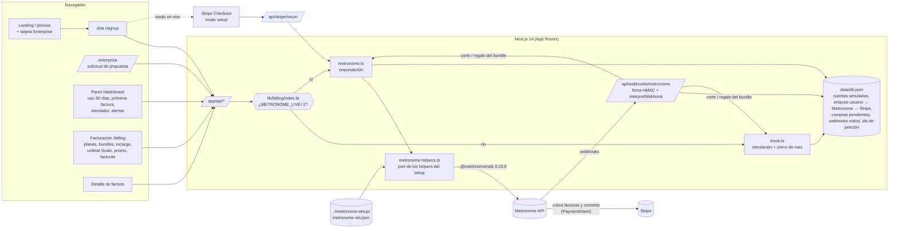

# nebula.ai · Demo de facturación por uso con Metronome + Stripe

Demo en español de una SaaS ficticia, **nebula.ai**, que vende una API de IA generativa (texto e imágenes) con planes por uso. La facturación se modela en **Metronome** y los cobros se hacen con **Stripe**. **Todas las cifras son de ejemplo.**

- **Modo simulado** (por defecto): no llama a nada externo. Reproduce en local el comportamiento acordado de Metronome + Stripe y guarda los datos en `./data/db.json`, así que sobreviven a los reinicios.
- **Modo en vivo** (Metronome en vivo): llama a la API real de Metronome con el SDK oficial [`@metronome/sdk`](https://www.npmjs.com/package/@metronome/sdk) y usa Stripe Checkout en modo *setup* para guardar la tarjeta.

En todas las pantallas se ve un indicador **«Modo simulado»** (ámbar) o **«Metronome en vivo»** (verde).

## Catálogo (datos de ejemplo)

| | Free | Pro | Scale | Enterprise |
|---|---|---|---|---|
| Cuota mensual | 0 € | 29 € | 199 € | compromiso anual (desde 12 000 €) |
| Créditos incluidos/mes | 5 € | 30 € | 250 € | – (el uso consume el compromiso) |
| Descuento en uso | – | 10 % | 20 % | precios negociados por métrica |
| Al llegar a 0 € | se corta el acceso | se corta el acceso (o recarga automática) | el exceso se factura a fin de mes; cobro anticipado cada 300 € de exceso | true-up al final del año |

Uso: tokens de entrada 2 €/M, tokens de salida 8 €/M, imágenes 0,04 €. Bundles (12 meses): pagas 50 → recibes 55; 200 → 230; 1000 → 1200. Recarga automática (Pro/Scale): si el saldo baja de 10 €, se cobra lo necesario para dejarlo en 50 €. Códigos promocionales: `BIENVENIDA10` (10 €, 30 días) y `LANZAMIENTO25` (25 €, 60 días). Aviso de saldo bajo al 20 % de los créditos del plan y a 0 €.

Los créditos del plan se prorratean en el primer mes y caducan cada mes. Bundles, regalos y promociones se conservan al cambiar de plan.

## Arquitectura



| Fichero | Qué hace |
|---|---|
| `lib/catalog.ts` | Métricas, planes (con `rank`), bundles, recarga (10 → 50 €), umbral de Scale (300 €), prioridades, promociones, ejemplo Enterprise. |
| `lib/billing/metronome-types.ts` | **Copia literal** de `metronome-setup/types.ts` (contrato de datos de la UI: `UpcomingInvoicePreview`, `UsageLast30Days`, `EnterpriseContractSummary`, `WebhookAction`…). |
| `lib/billing/metronome-helpers.ts` | **Port a `@metronome/sdk` de `metronome-setup/src/helpers/*`**, con los mismos nombres (`buildPlanContractBody`, `changePlan`, `buildBundleCommitEdit`, `grantBundleBonus`, `findBundleCommit`, `syncPlanLowBalanceAlert`, `getUpcomingInvoicePreview`, `getUsageLast30Days`, `grantPromoCredit`, `interpretWebhook`…) y los mismos cuerpos. Un test comprueba que son **idénticos** a los de `dry-run-helpers.txt`. |
| `lib/billing/metronome-config.ts` | Lee `metronome-ids.json` en el formato del setup (`MetronomeIds` de `src/ids.ts`); sin fichero construye el mismo objeto con variables de entorno. Rechaza ficheros de dry-run. |
| `lib/billing/metronome.ts` | Modo en vivo: enlace usuario ↔ IDs, idempotencia con ids de la app, corte Free/Pro, regalo tras el pago, mapeo a `Account`. |
| `lib/billing/mock.ts` | Simulación con la misma semántica (transiciones, cierre de mes, compras con pago confirmado por webhook, promos, umbral de gasto, dedupe por id de petición). |
| `lib/billing/insights.ts` | Cálculos puros: uso de 30 días, `recommendPlan`, propuesta Enterprise. |
| `lib/webhooks.ts` | Firma + `interpretWebhook` → acciones: aviso, corte de acceso, regalo del bundle, avisos de pago. |
| `lib/store.ts` | JSON con escritura atómica: cuentas simuladas, enlaces, compras (`purchases`), webhooks vistos, ids de petición, solicitudes Enterprise. |

## Arrancar en modo simulado

```bash
npm install
npm run build && npm start      # http://localhost:3000  (o npm run dev)
npm test                        # tests unitarios (vitest)
```

- `http://localhost:3000/api/demo` crea una cuenta Pro de ejemplo (bundle de 50 € comprado, 30 días de histórico) y entra en el panel.
- Los datos se guardan en `./data/db.json`. Si lo borras, empiezas de cero.
- Prueba de webhook en simulado (sin secreto se acepta y se marca como «sin firma»). `threshold: 0` es la alerta global de saldo 0 y corta el acceso en Free/Pro:

```bash
curl -X POST localhost:3000/api/webhooks/metronome -H 'content-type: application/json' \
  -d '{"id":"prueba-1","type":"alerts.low_remaining_contract_credit_and_commit_balance_reached","properties":{"customer_id":"<customerId de /api/me>","threshold":0,"remaining_balance":0}}'
```

- Ingesta idempotente: `POST /api/usage` con `{"requests":[{"requestId":"req-1","inputTokens":1000,"outputTokens":500}]}`. Si repites el mismo `requestId`, responde `duplicates: 1` y no cobra.

## Pasar a modo en vivo

1. Ejecuta el setup del experto (`cd ../metronome-setup && npm run setup`, **sin** `--dry-run`). Genera `metronome-ids.json`. La web lo lee de `../metronome-setup/metronome-ids.json` (o de `METRONOME_IDS_FILE`).
2. Copia `.env.example` a `.env` y rellena:

| Variable | Obligatoria | Qué es / quién la aporta |
|---|---|---|
| `METRONOME_LIVE=1` | sí | Activa el modo en vivo (sin ella, la demo sigue simulada aunque haya token). |
| `METRONOME_API_KEY` (o `METRONOME_API_TOKEN` / `METRONOME_BEARER_TOKEN`) | sí | Token del **Sandbox** de Metronome conectado a Stripe en modo test (**experto de Metronome**). |
| `METRONOME_IDS_FILE` | no | Ruta al fichero de IDs. |
| `METRONOME_WEBHOOK_SECRET` | sí | Secreto del webhook apuntando a `https://<app>/api/webhooks/metronome`. |
| `STRIPE_SECRET_KEY` | sí | Clave secreta de la **misma cuenta** de Stripe conectada a Metronome (**experto de Stripe**). |
| `APP_URL` | recomendable | URL pública para las URLs de vuelta de Stripe. |
| `METRONOME_*` (IDs sueltos) | no | Alternativa a `metronome-ids.json` (ver `.env.example`). |

Requisitos del dashboard (no se pueden hacer por API): ver la sección 3 del README de `metronome-setup` (Sandbox, conexión de Stripe, productos `prod_…` en Stripe y regla de mapeo `stripe_product_id`, webhook, método de pago por defecto, EUR habilitado).

### Formato de `metronome-ids.json`

Exactamente el de `metronome-setup/src/ids.ts` (ejemplo: `metronome-setup/metronome-ids.dry-run.json`):

```jsonc
{
  "generated_at": "…", "base_url": "https://api.metronome.com", "dry_run": false,
  "credit_types": { "EUR": "<uuid>" },
  "billable_metrics": { "input_tokens": "…", "output_tokens": "…", "images": "…" },
  "products": {
    "usage":        { "input_tokens": "…", "output_tokens": "…", "images": "…" },
    "subscription": { "pro": "…", "scale": "…" },
    "fixed": { "plan_credits": "…", "bundle_commit": "…", "bundle_bonus": "…", "auto_recharge": "…",
               "spend_threshold": "…", "promo_credit": "…", "enterprise_commit": "…" }
  },
  "rate_card": { "id": "…", "alias": "nebula_eur" },
  "alerts": { "zero_balance": "…", "zero_balance_uniqueness_key": "nebula-zero-balance-eur-v1" },
  "event_types": { "input_tokens": "nebula_llm_request", "output_tokens": "nebula_llm_request", "images": "nebula_image_generation" },
  "event_properties": { "input_tokens": "input_tokens", "output_tokens": "output_tokens", "images": "images" },
  "auto_recharge": { "threshold_eur": 10, "recharge_to_eur": 50 },
  "spend_threshold": { "scale_threshold_eur": 300 },
  "amount_scale": 1,
  "catalog": { "plans": { … }, "bundles": { … } }
}
```

## Qué llamada de Metronome hay detrás de cada pantalla

Los cuerpos son los de los helpers del setup (verificados por el experto contra `spec/openapi.json`), y además el compilador los valida con los tipos de `@metronome/sdk` 3.10.0. **Importes EUR = unidades enteras.**

| Pantalla / endpoint | Modo en vivo (helper → endpoint) |
|---|---|
| `/signup` → `POST /api/stripe/setup-session` | Stripe `customers.create` + `checkout.sessions.create({ mode: "setup" })`. |
| `GET /api/stripe/return` | Stripe `checkout.sessions.retrieve` + `customers.update(default_payment_method)`. `createCustomerWithStripe` (`GET /v1/customers?ingest_alias`, `POST /v1/customers`, idempotente por alias `usr_<hash del cliente de Stripe>`), `createPlanContract` (`POST /v1/contracts/create`, `uniqueness_key` `nebula-signup-<cliente>`; Scale con `spend_threshold_configuration`), `syncPlanLowBalanceAlert`. Recargar la URL no duplica nada. |
| `GET /api/me`, `/dashboard`, `/billing` | `getBalanceSummary` (`customerBalances/list` + `getNetBalance`), `listInvoices`, `getContract` (`/v2/contracts/get`: recarga y umbral), `getUpcomingInvoicePreview` (DRAFT USAGE del periodo) → widget «Próxima factura», `getUsageLast30Days` (`POST /v1/usage`, DAY) → gráfico de 30 días + `recommendPlan`. |
| `POST /api/usage` | Free/Pro: si un webhook de saldo 0 cortó el acceso, o `getNetBalanceEur` ≤ 0, se rechaza. Luego `ingest` (`POST /v1/ingest`): **un evento por petición** (`llmRequestEvent` / `imageGenerationEvent`) con `transaction_id` = **id de petición de la app**; si una petición trae texto e imágenes, la segunda lleva el sufijo `:images`. La web descarta localmente ids ya vistos. |
| `POST /api/plan/change` | `changePlan`: `POST /v1/contracts/create` con `transition: { type: "RENEWAL", from_contract_id }`, mismo ancla de facturación (`CUSTOM_DATE`). Subida: desde ahora, prorrateo; bajada: desde el siguiente periodo (la web la muestra como programada y la aplica al llegar la fecha). Con `rollover_fraction: 1` en créditos y commits, el saldo pasa al contrato nuevo. Después, `syncPlanLowBalanceAlert` **archiva** la alerta del 20 % anterior y crea la del plan nuevo. |
| `POST /api/bundles/buy` | Id de compra del navegador (`Idempotency-Key`). `buyBundle` → `/v2/contracts/edit` `add_commits` PREPAID con payment gate, `uniqueness_key nebula-bundle-<id>`, custom field `nebula_purchase_id`. Con el webhook `payment_gate.payment_status = paid` se recorren las compras pendientes del cliente; para cada una, `findBundleCommit` (por `nebula_purchase_id`) y, **solo si el commit existe**, `grantBundleBonus` (`nebula-bonus-<id>`). Si el pago falla, la compra queda como fallida. |
| `POST /api/autorecharge` | `setAutoRecharge` → `add_/update_prepaid_balance_threshold_configuration` (10 → 50 €, commit con payment gate). |
| `POST /api/spend-threshold` (Scale) | `setSpendThreshold` → `add_/update_spend_threshold_configuration` (300 €, payment gate Stripe). No se puede combinar con la recarga automática. |
| `POST /api/promo` | `grantPromoCredit` → `add_credits` con caducidad, prioridad 3, `uniqueness_key nebula-promo-<cliente>-<código>` (409 ⇒ «ya canjeado»). |
| `/enterprise` → `POST /api/enterprise` | Demo: guarda la solicitud en local y devuelve una propuesta de ejemplo (`EnterpriseContractSummary`). En real, ventas usaría `createEnterpriseContract` del setup (no se llama desde la web). |
| `/billing/invoices/:id` | `getInvoice` (`GET /v1/customers/{id}/invoices/{invoice_id}`). |
| `POST /api/webhooks/metronome` | Firma HMAC (`X-Metronome-Date` o `Date`, 5 min) → `interpretWebhook`: `offer_top_up` (aviso), `cut_access` (alerta global de 0 € ⇒ corte en Free/Pro), `payment_succeeded` (regalo del bundle y fin del corte), `payment_failed` (compra fallida; si es el cobro por umbral, corte), `payment_requires_action` (3DS), `threshold_charge_started` (`payment_gate.threshold_reached`). Se deduplica por `id` en `db.json` **después** de procesar (si falla, responde 500 y Metronome reintenta). |

Prioridades de consumo (iguales al setup): plan 1 → promo 3 → regalo del bundle 5 → commits pagados 10 → Enterprise 20. Todos los créditos y commits se aplican con el tag `nebula_usage` (no pagan la cuota).

### Revisión del experto (sección 8 de su README): estado

| # | Punto | Estado |
|---|---|---|
| 1 | La subida editaba el contrato | ✅ Subida y bajada por transición RENEWAL (`changePlan`). En simulado, la subida conserva el saldo y la bajada se programa y mantiene bundle, regalo y promos (test). |
| 2 | Créditos completos con cuota prorrateada | ✅ Proration por defecto (FIRST_AND_LAST) como el setup. El simulado también prorratea el primer mes. |
| 3 | Sin `rollover_fraction` | ✅ `rollover_fraction: 1` en créditos del plan, bundle, regalo, promo y recarga automática. |
| 4 | Regalos emparejados por contrato | ✅ Por `purchaseId` (custom field `nebula_purchase_id` + `findBundleCommit`). Las compras fallidas o de más de 24 h sin commit se cierran. |
| 5 | `uniqueness_key` aleatorias | ✅ Deterministas: `nebula-signup-<cliente>`, `nebula-<cliente>-<plan>-<inicio>`, `nebula-bundle/bonus-<id de compra>`, `nebula-promo-<cliente>-<código>`, `nebula-low-<cliente>-<plan>`. Los 409 se tratan como «ya hecho». |
| 6 | No se archivaban las alertas del 20 % | ✅ `syncPlanLowBalanceAlert` en el alta, en la subida y al aplicarse una bajada. |
| 7 | Recarga hasta 60 vs 50 | ✅ 50 € (de `auto_recharge.recharge_to_eur`); el simulado también «recarga hasta 50». |
| 8 | Ingesta fusionada con `transaction_id` aleatorio | ✅ Un evento por petición con `transaction_id` = id de la petición de la app; dedupe también en local. |
| 9 | `package_id` sin `billing_provider_configuration` | ✅ Eliminada la ruta de *packages* (el setup no los crea). |
| 10 | `update_contract_end_date` antes de la transición | ✅ Eliminado: solo la transición. |
| 11 | El corte dependía solo de `listBalances` | ✅ Webhook de saldo 0 (`cut_access`) + `getNetBalance` antes de ingerir. |
| 12 | Dedupe en memoria; faltan `threshold_reached` y `workflow_type: "spend"` | ✅ Dedupe persistida en `db.json` (5000 ids / 7 días) y marcada tras procesar; `payment_gate.threshold_reached` y `payment_status` de `spend` gestionados. (La dedupe ya se guardaba en `db.json` antes: el experto leyó `store` como memoria.) |

## Tests

`npm test` (vitest, 58 tests):

- `tests/mock-billing.test.ts` (32): alta con prorrateo (y aviso inmediato si nace bajo el 20 %), subida con rollover, **bajada programada que conserva bundle y regalo**, cancelación de bajada, re-sincronización del aviso del 20 %, cierre de mes (exceso facturado, cuota y créditos nuevos), orden plan → promo → regalo → commit, bloqueo Free/Pro, **regalo solo tras el webhook de pago** (y no con un pago fallido o un segundo pago), compra idempotente, **ingesta idempotente por id de petición**, umbral de gasto en Scale (cobro de 300 €), exclusión recarga/umbral, recarga hasta 50 €, promos (canje único, caducidad), corte por webhook de saldo 0 (no en Scale), próxima factura, uso de 30 días, `recommendPlan`, propuesta Enterprise, persistencia.
- `tests/webhooks.test.ts` (9): firma con el **vector oficial de la documentación**, cabecera `Date`, rechazo de cuerpo alterado y de notificaciones antiguas, `threshold_reached`, cobro por umbral fallido ⇒ corte, **dedupe que sobrevive a un reinicio**, clientes desconocidos.
- `tests/metronome-helpers.test.ts` (17): **paridad exacta con `metronome-setup/dry-run-helpers.txt`** (cliente, contratos Free/Pro/Scale, subida y bajada por transición, bundle + bonus, alerta del 20 %, promo, eventos de ingesta, `/v1/usage`), transaction ids deterministas, `interpretWebhook`, vista previa desde facturas DRAFT, mapeos a la UI, cargador de IDs (formato del setup, rechazo de dry-run, variables de entorno).

## TODO abiertos

Marcados en el código como `// TODO(verificar)` o descritos aquí:

1. **Nada del modo en vivo se ha ejecutado contra Metronome real** (no hay credenciales). Los cuerpos coinciden con los del setup (validados contra la spec) y con los tipos del SDK, pero falta una pasada en el Sandbox.
2. **Tipos del SDK desfasados**: `duration` y `rollover_fraction` del commit de la recarga automática están en la spec (`PrepaidBalanceThresholdCommit`) pero no en las typings de `@metronome/sdk` 3.10.0; se envían fuera del tipo. Confirmar en el Sandbox.
3. **Abono de la cuota al subir de plan** por transición (duda §7 del setup): el simulado abona la parte no consumida de la cuota anterior; confirmar qué hace Metronome.
4. **Cancelar una bajada programada** en vivo: habría que archivar el contrato futuro (`/v1/contracts/archive`). No está en los helpers del setup; ahora la web pide contactar con soporte (en simulado sí se cancela).
5. **Emparejado del webhook de pago**: `payment_gate.payment_status` no trae el id de compra. Se comprueba con `findBundleCommit`, pero con varias compras a la vez y un solo webhook de fallo, la que falla se detecta porque su commit no existe (y el resto sigue pendiente hasta su propio webhook o 24 h). Validar en el Sandbox que el commit aparece en `customerBalances/list` antes de que llegue el webhook.
6. **Promociones**: la web valida los códigos (`BIENVENIDA10`, `LANZAMIENTO25`) y envía importe/validez explícitos; el setup trae `WELCOME`/`LAUNCH2026` con los mismos importes. Decidir los nombres definitivos. Duda del setup: ¿los créditos con rollover conservan su caducidad?
7. **Alertas**: confirmar si la de 0 € salta al llegar a 0 o solo por debajo (§7 del setup). Con créditos prorrateados, un alta a final de mes puede empezar ya por debajo del umbral fijo del 20 % (Free: 0,87 € < 1 €) y, con `evaluate_on_create`, avisar al instante (el simulado lo reproduce). Valorar un umbral proporcional para el primer mes. El corte se levanta al confirmarse un pago o cuando `customerBalances` vuelve a dar saldo (con 2 min de margen por el retraso).
8. **Auto-recarga y umbral de gasto** se tratan como excluyentes (igual que el setup); confirmar si pueden convivir. Los mínimos de la recarga (umbral ≥ 5, recarga ≥ umbral + 10) están en $ en la doc; se asume lo mismo en EUR.
9. **Uso de 30 días en vivo**: `POST /v1/usage` da cantidades por métrica; el coste diario del gráfico se estima con la tarifa y el descuento del plan (la cifra facturada es la de las facturas).
10. **Stripe 3D Secure**: `payment_gate.payment_pending_action_required` se muestra como aviso, pero falta un enlace para completar el pago.
11. **Enterprise**: la solicitud solo se guarda en local (no se envía a nadie) y la propuesta es de ejemplo; no se llama a `createEnterpriseContract` desde la web.
12. **Persistencia**: `data/db.json` vale para un único proceso. Con varias instancias haría falta una base de datos (SQLite/Postgres), sobre todo para las compras pendientes y la dedupe de webhooks.
